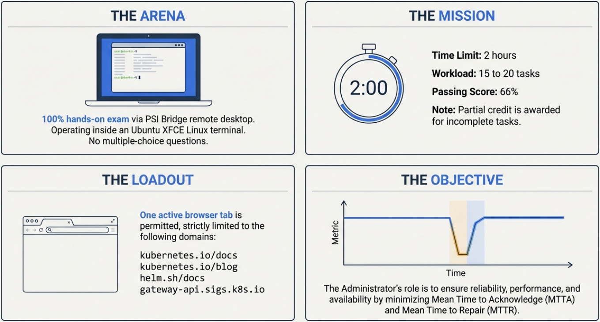

# CKA (Certified Kubernetes Administrator) Preparation

This repository is a comprehensive preparation environment for the Certified Kubernetes Administrator (CKA) exam. It includes a fully automated Terraform-based GCP practice lab, mock questions, topic-specific practice manifests, and extensive study notes.



---

## Quick Start — Spin Up the Practice Lab

```bash
# 1. Clone the repo
git clone https://github.com/<your-username>/cka-prep.git && cd cka-prep/lab

# 2. Configure your GCP project
cp terraform.tfvars.example terraform.tfvars
# Edit terraform.tfvars with your project_id

# 3. Launch — auto mode gives you a ready cluster in ~5 minutes
export GOOGLE_APPLICATION_CREDENTIALS=~/cka-terraform-key.json
terraform init && terraform apply -var="auto_cluster=true"
```

> See [lab/docs/getting-started.md](lab/docs/getting-started.md) for the complete setup guide including GCP project creation and credentials.

---

## Prerequisites

| Tool               | Purpose                      | Install                                                                                |
| ------------------ | ---------------------------- | -------------------------------------------------------------------------------------- |
| `gcloud` CLI       | GCP project setup & auth     | [cloud.google.com/sdk](https://cloud.google.com/sdk/docs/install)                      |
| `terraform` >= 1.5 | Provision lab infrastructure | [developer.hashicorp.com/terraform](https://developer.hashicorp.com/terraform/install) |
| `git`              | Clone this repo              | Pre-installed on most systems                                                          |
| GCP account        | Run the VMs                  | ~$20 in credits covers ~50 sessions                                                    |

---

## Repository Structure

```
cka-prep/
├── 01-cluster-architecture/   # Cluster Architecture, Installation & Configuration (25%)
├── 02-workloads-scheduling/   # Workloads & Scheduling (15%)
├── 03-services-networking/    # Services & Networking (20%)
├── 04-storage/                # Storage (10%)
├── 05-troubleshooting/        # Troubleshooting (30%)
├── lab/                       # Terraform GCP Practice Lab
│   ├── docs/                  # Lab documentation (getting-started, ADR, overview)
│   ├── scripts/               # Startup script templates
│   ├── *.tf                   # Terraform configuration files
│   └── terraform.tfvars.example
├── mock-exams/                # Full mock exam scenarios
├── manifests/                 # Practice YAML manifests & snippets
├── scripts/                   # Helper scripts (e.g., setup-env.sh)
├── src/                       # Images and assets
├── CKA-tips.md                # Exam Day Tips — terminal, Vim, PSI Bridge
├── CKA-Syllabus.md            # Syllabus breakdown (2026)
├── bookmarks.md               # Useful links and references
└── .vimrc                     # Custom Vim config for the exam environment
```

---

## Practice Lab

The `lab/` directory contains a fully automated, ephemeral Kubernetes practice environment on GCP using Terraform.

| Mode       | Command                                    | Use case                                                |
| ---------- | ------------------------------------------ | ------------------------------------------------------- |
| **Manual** | `terraform apply`                          | Practice `kubeadm init` and node joining                |
| **Auto**   | `terraform apply -var="auto_cluster=true"` | Jump straight into scenario practice on a ready cluster |

**Default config:** 1 control plane (`e2-standard-2`) + 2 workers (`e2-medium`), Kubernetes v1.34, Calico CNI, Helm.  
**Cost:** ~$0.40/session (2-3 hrs). Always run `terraform destroy` after.

📖 **Lab Documentation:**

- [Getting Started](lab/docs/getting-started.md) — Full setup walkthrough
- [Lab Overview](lab/docs/lab-overview.md) — Architecture diagram and how the Terraform code works
- [ADR-001](lab/docs/ADR-001-lab-architecture.md) — Why I built it this way

---

## Exam Objectives

> As of June 2026

| Domain                                             | Weight  |
| -------------------------------------------------- | ------- |
| Cluster Architecture, Installation & Configuration | **25%** |
| Workloads & Scheduling                             | **15%** |
| Services & Networking                              | **20%** |
| Storage                                            | **10%** |
| Troubleshooting                                    | **30%** |

---

## Exam Overview

### The Arena

- **Format:** 100% hands-on exam via PSI Bridge remote desktop.
- **Environment:** Ubuntu remote desktop with XFCE desktop environment, accessed via PSI Bridge.
- **Questions:** No multiple-choice questions.

### The Mission

- **Time Limit:** 2 hours
- **Workload:** 15 to 20 tasks
- **Passing Score:** 66%
- **Note:** Partial credit is awarded for incomplete tasks.

### The Loadout

One active browser tab is permitted, strictly limited to the following domains:

- [kubernetes.io/docs](https://kubernetes.io/docs/)
- [kubernetes.io/blog](https://kubernetes.io/blog/)
- [helm.sh/docs](https://helm.sh/docs/)
- [gateway-api.sigs.k8s.io](https://gateway-api.sigs.k8s.io/)

### Technical & Environmental Requirements

- **OS:** Windows 10/11 (64-bit), macOS 13.x+, or Ubuntu 22.04.
- **Software:** PSI Secure Browser (downloads at exam start) to access the PSI Bridge remote desktop. You must use the provided Firefox browser inside the remote desktop.
- **Hardware:**
  - **Screen:** 1920x1080 minimum (32-bit color). _Dual monitors are not supported._
  - **Webcam:** 640x480 minimum. Must provide a 360˚ room view (external camera required for desktops). You must remain centered in the frame.
  - **Mic/Network:** Functional microphone and at least 300 kbps up/down internet bandwidth.
- **Room Setup:** Must be private, quiet, and well-lit (no public spaces). Desk must be completely clear of papers and electronics.

### The Objective

The Administrator's role is to ensure reliability, performance, and availability by minimizing Mean Time to Acknowledge (MTTA) and Mean Time to Repair (MTTR).

---

## Resources

- [Kubernetes Documentation](https://kubernetes.io/docs/home/)
- [CKA Exam Details](https://training.linuxfoundation.org/certification/certified-kubernetes-administrator-cka/)
- [kubectl Cheat Sheet](https://kubernetes.io/docs/reference/kubectl/cheatsheet/)
- **[Exam Day Tips](CKA-tips.md)** — Study strategy, terminal handling, Vim essentials, and PSI Bridge navigation.
- **[Bookmarks](bookmarks.md)** — Curated links for quick reference during study.
