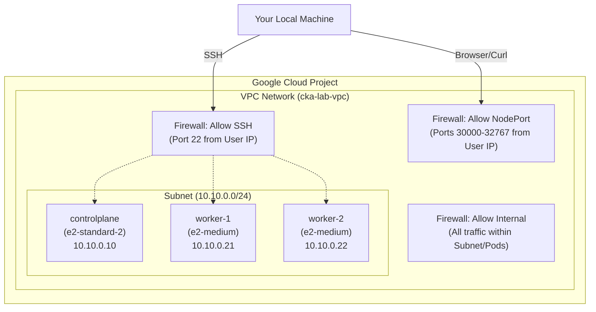

# CKA Practice Lab — Terraform Overview

This document explains what the Terraform code provisions in Google Cloud Platform (GCP) and how the lab architecture is designed to support CKA preparation.

## Architecture Diagram

## Infrastructure Components

When you run `terraform apply`, the code provisions the following resources:

1. **VPC Network & Subnet:** A custom VPC (`cka-lab-vpc`) and a subnet (`cka-lab-subnet`) with the IP range `10.10.0.0/24`.
2. **Compute Instances (VMs):**
   - **Control Plane Node (`e2-standard-2`):** 2 vCPU, 8 GB RAM, 50 GB Disk. Has a static internal IP of `10.10.0.10`.
   - **Worker Nodes (`e2-medium` x2):** 2 vCPU, 4 GB RAM, 30 GB Disk. They are assigned static internal IPs of `10.10.0.21` and `10.10.0.22`.
3. **Firewall Rules:**
   - **SSH:** Allows SSH access (Port 22) _only_ from your current public IP address (detected automatically).
   - **Internal:** Allows all traffic (TCP/UDP/ICMP) within the subnet and the Pod CIDR network, enabling Kubernetes components and pods to communicate.
   - **NodePort:** Allows traffic on Kubernetes NodePort range (30000-32767) _only_ from your public IP address, allowing you to test deployed services from your local browser.
4. **SSH Keys:** Terraform automatically generates a fresh ED25519 SSH key pair (`cka-lab-key`) locally and injects the public key into the VMs via GCP metadata.

## VM Specs

| Node         | Machine Type  | vCPU | RAM  | Disk  | Reason                                                                                                         |
| :----------- | :------------ | :--- | :--- | :---- | :------------------------------------------------------------------------------------------------------------- |
| controlplane | e2-standard-2 | 2    | 8 GB | 50 GB | Runs API server + etcd + controllers. Needs extra RAM for Helm installs (ArgoCD, cert-manager, Gateway Fabric) |
| worker-1     | e2-medium     | 2    | 4 GB | 30 GB | Standard worker                                                                                                |
| worker-2     | e2-medium     | 2    | 4 GB | 30 GB | Standard worker. Needed for Q6 (scheduling across nodes) and drain/cordon practice                             |

## Estimated Cost

e2-standard-2: ~$0.067/hr
e2-medium x2: ~$0.034/hr × 2
Total: ~$0.135/hr ≈ $3.24/day if left running 24h

With terraform destroy after each session: < $1/session (2-3 hours)

## Operation Modes

The lab is designed to accommodate different types of CKA practice scenarios using the `auto_cluster` variable.

### 1. Manual Mode (Default)

**Use Case:** Practicing the manual bootstrapping of a Kubernetes cluster using `kubeadm`.

When you run `terraform apply` without any variables, Terraform executes the `common-setup.sh` startup script on all nodes. This prepares the VMs but stops short of creating the cluster.

- **What it does:** Disables swap, loads necessary kernel modules, configures `sysctl`, and installs `containerd`, `kubeadm`, `kubelet`, and `kubectl`.
- **What you do:** SSH into the nodes and manually execute `kubeadm init` and `kubeadm join`.

### 2. Auto Mode

**Use Case:** Practicing workload deployments, networking, and storage on an already running cluster.

When you run `terraform apply -var="auto_cluster=true"`, Terraform runs additional scripts to fully bootstrap the cluster.

- **What it does:**
  - Executes the same `common-setup.sh` script as Manual Mode.
  - **Control Plane:** Runs `controlplane-init.sh` to execute `kubeadm init` with a pre-generated token, installs the Calico CNI plugin, and installs Helm.
  - **Workers:** Runs `worker-join.sh` to poll the control plane API and automatically execute `kubeadm join`.
- **What you do:** SSH into the control plane and immediately begin practicing advanced Kubernetes scenarios on a `Ready` cluster.

## Terraform File Structure

| File              | Description                                                                  |
| :---------------- | :--------------------------------------------------------------------------- |
| `main.tf`         | Provider configuration, VPC, subnet, firewall rules, and SSH key generation. |
| `variables.tf`    | Definitions for configurable inputs (Project ID, Region, K8s version, etc.). |
| `outputs.tf`      | Outputs essential information after apply, such as IPs and SSH commands.     |
| `controlplane.tf` | Definition of the control plane Compute Engine instance.                     |
| `workers.tf`      | Definition of the worker Compute Engine instances (using a `count` loop).    |
| `scripts/`        | Startup script templates (bash) executed via VM metadata upon boot.          |
